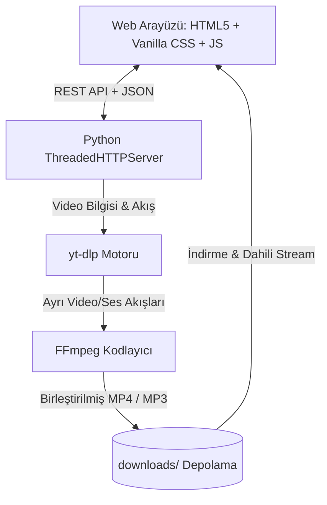

<div align="center">

# 🎬 YouTube Video & Audio Downloader Pro

<p align="center">
  <strong>Modern, Hızlı, Reklamsız ve Açık Kaynaklı Web Tabanlı YouTube Medya İndiricisi</strong>
</p>

[](https://www.python.org/)
[](https://github.com/yt-dlp/yt-dlp)
[](https://ffmpeg.org/)
[](https://github.com/devilteams-s/Youtube-Downloader-Web)
[](LICENSE)

<br/>

[✨ Özellikler](#-öne-çıkan-özellikler) •
[🚀 Hızlı Başlangıç](#-hızlı-başlangıç) •
[🛠️ Mimarisi](#-teknik-mimari) •
[📡 REST API](#-api-servisleri) •
[💡 Sıkça Sorulanlar](#-sorun-giderme--ipuçları)

---

</div>

## 🌟 Öne Çıkan Özellikler

| Özellik | Açıklama |
| :--- | :--- |
| **🎬 4K / 1080p MP4 Video** | YouTube üzerindeki en yüksek kullanılabilir çözünürlükleri (4K, 1080p Full HD, 720p HD) ses ile birleştirerek kaydeder. |
| **🎵 320 kbps MP3 Ses** | Videolardan saf sesi ayıklar ve stüdyo kalitesinde 320 kbps sabit bit hızlı (CBR) MP3 formatına dönüştürür. |
| **⚡ Canlı İlerleme Takibi** | İndirme esnasında gerçek zamanlı yüzdelik çubuk, aktarım hızı (MB/s), kalan süre (ETA) ve boyut telemetrisi sunar. |
| **🔍 Akıllı Link Ayıklayıcı** | Mix ve Playlist bağlantılarını (`&list=RD...`) otomatik olarak tekil videoya indirgeyerek kilitlenmeleri önler. |
| **📺 Dahili Medya Oynatıcı** | İndirilen videoları ve müzikleri sayfadan çıkmadan doğrudan tarayıcı içinde önizlemenizi sağlar. |
| **🎨 Cyber-Dark Tasarım** | Glassmorphism efektleri, neon ışımalar ve tam mobil uyumlu modern kullanıcı arayüzü. |
| **📋 Tek Tık Pano Entegrasyonu** | Kopyalanan YouTube bağlantısını algılayıp tek tıkla yapıştırma ve anında analize gönderme desteği. |

---

## 📸 Ekran Görünümü ve Arayüz

```text
 ┌────────────────────────────────────────────────────────────────────────┐
 │ ▶ YT Downloader PRO                     [yt-dlp Aktif] [FFmpeg 1080p]  │
 ├────────────────────────────────────────────────────────────────────────┤
 │  [ 🔗 https://www.youtube.com/watch?v=...     ] [📋 Yapıştır] [Getir] │
 ├────────────────────────────────────────────────────────────────────────┤
 │  ┌───────────────┐  Video Başlığı                                      │
 │  │   THUMBNAIL   │  Kanal Adı • 1.2M Görüntülenme • 03:45              │
 │  │   PREVIEW     │  [ 🎬 Video (MP4) ]  [ 🎵 Ses (MP3) ]               │
 │  └───────────────┘  (1080p) (720p) (480p) (360p)                       │
 │                     [          📥 MP4 VİDEOYU İNDİR          ]         │
 ├────────────────────────────────────────────────────────────────────────┤
 │  İlerleyiş: [████████████████████░░░░░░░] 74% • 12.4 MB/s • Kalan: 3sn │
 ├────────────────────────────────────────────────────────────────────────┤
 │  📂 İndirilenler Kütüphanesi:                                          │
 │  • Video-1.mp4 (45.2 MB)  --> [▶ Oynat] [📥 Bilgisayara Kaydet] [🗑]  │
 └────────────────────────────────────────────────────────────────────────┘
```

---

## 🚀 Hızlı Başlangıç

### 1. Gereksinimler
* **Python 3.9+** ([Python İndir](https://www.python.org/downloads/))
* **FFmpeg** (Medya birleştirme ve MP3 dönüştürme için)
  * **Ubuntu / Debian:** `sudo apt install ffmpeg`
  * **Arch Linux:** `sudo pacman -S ffmpeg`
  * **macOS:** `brew install ffmpeg`
  * **Windows:** `winget install Gyan.FFmpeg` veya [ffmpeg.org](https://ffmpeg.org/download.html)

### 2. Kurulum
Projeyi klonlayın ve bağımlılığı yükleyin:
```bash
# Depoyu klonlayın
git clone git@github.com:devilteams-s/Youtube-Downloader-Web.git
cd Youtube-Downloader-Web

# yt-dlp kütüphanesini yükleyin
pip install yt-dlp
```

### 3. Çalıştırma

#### 🐧 Linux & macOS:
```bash
./start-server.sh
# Veya doğrudan:
python3 server.py
```

#### 🪟 Windows:
`start-server.bat` dosyasına çift tıklayın veya komut satırından:
```cmd
python server.py
```

Sunucu başladığında tarayıcınızda otomatik olarak **`http://localhost:5180`** açılacaktır.

---

## 🛠️ Teknik Mimari

Proje harici ağır framework'lere ihtiyaç duymadan, saf web standartları ve hafif arka yüz ile tasarlanmıştır:



* **Frontend:** Vanilla JS (`app.js`), Modern Responsive CSS (`style.css`), Semantik HTML5 (`index.html`).
* **Backend:** Python `http.server` & `socketserver.ThreadingMixIn` (Çok iş parçacıklı non-blocking mimari).
* **Medya İşleme:** `yt-dlp` indirme motoru ve `ffmpeg` post-processor.

---

## 📡 API Servisleri

Sunucu yerleşik REST API uç noktaları sağlar:

| Metot | Uç Nokta | Açıklama |
| :--- | :--- | :--- |
| `POST` | `/api/info` | Gönderilen video URL'sinin çözünürlüklerini, başlığını ve metaverisini getirir. |
| `POST` | `/api/download` | Belirtilen format veya ses türünde arka plan indirme görevi başlatır. |
| `GET` | `/api/progress?id={task_id}` | Görevin anlık indirme yüzdesini, hızını ve kalan süresini döner. |
| `GET` | `/api/downloads` | Yerel depodaki tamamlanmış indirilen dosyaları listeler. |
| `GET` | `/api/get-file?filename={name}` | İndirilen dosyayı tarayıcıya ek (attachment) olarak aktarır. |
| `DELETE`| `/api/delete?filename={name}` | İndirilen dosyayı yerel depolama alanından temizler. |

---

## 💡 Sorun Giderme & İpuçları

> [!TIP]
> **Çalma Listesi / Mix Bağlantıları:** Bir müzik mix'i veya playlist linki yapıştırdığınızda sistem bağlantıyı otomatik temizler (`&list=...` parametresini siler) ve doğrudan tıkladığınız videoyu hızlıca indirir.

> [!NOTE]
> **1080p ve 4K Videolarda Ses Sorunu:** YouTube, 720p üzerindeki videoları görüntü ve sesi ayrı akışlar (DASH stream) olarak barındırır. Bu iki akışı kusursuz biçimde birleştirmek için sisteminizde `ffmpeg` kurulu olmalıdır.

---

## 📄 Lisans

Bu proje **MIT Lisansı** kapsamında açık kaynak olarak sunulmuştur. Detaylar için `LICENSE` dosyasına bakabilirsiniz.

<div align="center">
  <sub>Geliştirici: <strong>@devilteams-s</strong> • Kaliteli ve açık kaynak yazılımlar için üretildi.</sub>
</div>
